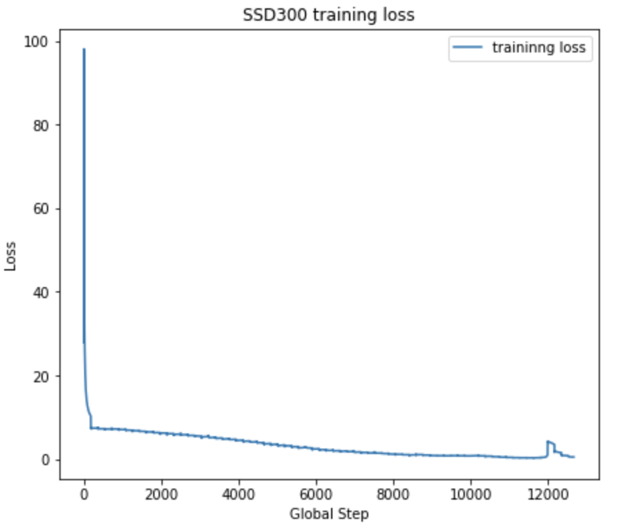

# SSD300 Model in PyTorch

## Dataset
PASCAL VOC2012

## Usage

### Train the Model

```bash
cd code
python3 train_ssd.py
```

Since the pre-trained VGG_16 weight is not uploaded (too big), this may call some error. But you could download it by following bash command.

```bash
cd weight
wget https://s3.amazonaws.com/amdegroot-models/vgg16_reducedfc.pth
``` 

### Evaluate the Model

```bash
cd code
python3 evaluation_ssd.py
```

### Get a Demo

```bash
cd code
python3 demo.py
```
The result images and ground truth images would be saved in directory called `img`

tips: Since the trained weigt is not been uploaded (too big), this part would call some errors. You could look into the directory `img` directly to see the result demo produced by ourselves.

### Result

#### Training Loss:



#### On training set: 

mAP Matrix:

[0.91019469 0.84114809 0.88723437 0.67804573 0.37342244 0.91621779
 0.73382705 0.97321562 0.80776674 0.84021185 0.9088941  0.96271324
 0.92898749 0.95671725 0.66330431 0.69221699 0.78723723 0.95487637
 0.95664115 0.89042396]

mAP =  0.8331648228692401

#### On validation set:


